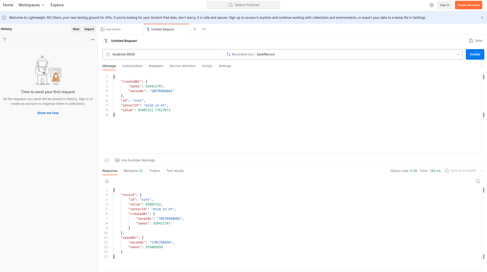
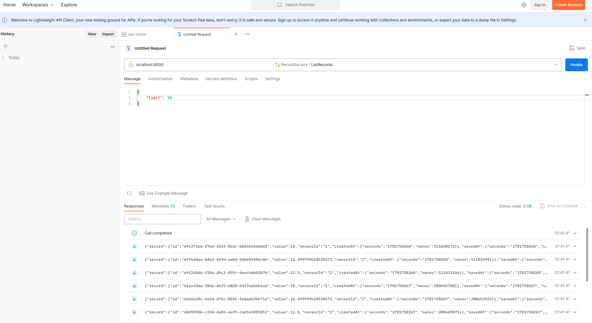

# protobuff-sandbox
A little playground arround golang protocol buffer

## grpc contract
The grpc contracts definitions in located [here](./contracts/record.proto)


## To start the grpc server
```go
go run server/server.go
```

## To start the grpc client
```go
go run client/client.go
```

## Save Record Example
To save a new record:



## List Records Example
To list records:
